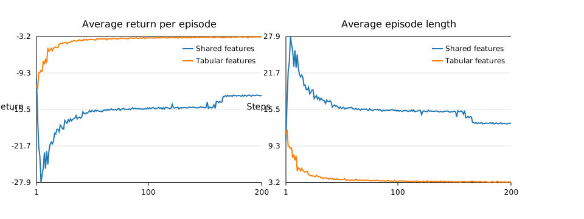

# REINFORCE on the Short Corridor

## Implementation overview
- Environment: implemented the short corridor with switched actions from Sutton & Barto (Example 13.1). The agent receives -1 per step, starts on the left, and action semantics are swapped in the second cell. Episodes terminate on reaching the right terminal state.
- Policy: binary logistic policy parameterised by linear features. Returns are estimated with Monte Carlo rollouts and gradients computed from stored action probabilities. An optional episode length cap avoids exceedingly long trajectories.
- Feature sets:
  1. **Shared features**: bias + indicator for the swapped state to generalise across normal corridor cells while letting the policy adjust the anomalous transition.
  2. **Tabular features**: one-hot vector for each non-terminal state to learn independent preferences per state.

Training runs used `α=0.05`, `γ=1`, `200` episodes per run, `200` random seeds, and a maximum of `200` steps per episode. Aggregated learning curves are stored in `results/reinforce_learning_curves.csv`.

## Results
The CSV contains per-episode averages across the 200 seeds for both parameterisations. Figure 1 visualises the learning curves for returns and episode lengths.

Key summary statistics:

| Metric | Shared features | Tabular features |
| --- | --- | --- |
| Final average return (episode 200) | -13.13 | -3.21 |
| Final average episode length | 13.13 steps | 3.21 steps |
| Mean return over first 20 episodes | -21.65 | -7.10 |
| Mean return over last 20 episodes | -13.17 | -3.23 |

Means for the first/last 20 episodes were computed directly from the aggregated traces.

## Discussion
- **Sample efficiency**: The shared-feature policy initially struggles because its limited representation cannot differentiate all corridor states. It learns slowly, averaging ~22 steps during the first 20 episodes versus ~7 for the tabular model.
- **Asymptotic performance**: Even after convergence, the shared representation plateaus around 13 steps per episode (return ≈ -13), whereas the tabular policy approaches near-optimal behaviour (≈3 steps). The tabular model’s flexibility lets it memorise the action semantics at each position, yielding faster progress and higher returns.
- **Variance reduction**: The aggregated results show smoother learning for the tabular agent because independent parameters can adapt to the switched-action cell without affecting others. The shared model must compromise between generalisation and handling the anomalous state, leading to persistent bias and longer episodes.

Overall, the tabular features deliver both faster learning and better asymptotic policies on this task, while the hand-crafted shared features underfit the environment’s idiosyncrasy.
